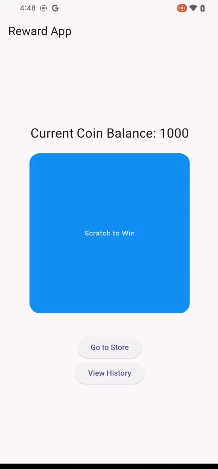
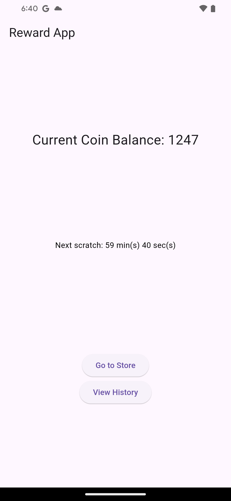

# Reward-App System

## Screenshot




This is a Flutter-based application for a reward system where users can earn coins through scratch cards and redeem them for various items. The app uses the **Bloc pattern** to manage the state of the application, providing a clean and scalable structure.

## Features
- **Scratch Card**: Users can scratch a card to earn coins (limited to one scratch per hour).
- **Redemption**: Users can redeem earned coins for various items in the store.
- **Transaction History**: All transactions (earnings and redemptions) are logged and displayed to the user.
- **Coin Balance Management**: The application manages the user’s coin balance, ensuring that redemptions are only possible if the user has enough coins.

## Architecture

The application follows the **Bloc** pattern for state management. It is structured to separate business logic from UI components, making the codebase easier to test, maintain, and scale.

### **Bloc Components**
- **RewardBloc**: Manages the user’s coin balance, scratch events, and redemption logic.
- **TransactionBloc**: Logs all coin-related transactions, including scratch rewards and item redemptions.

### **State and Events**
- **State**: Represents the current state of the application (e.g., the user’s current coin balance).
- **Events**: Trigger actions in the application (e.g., scratching the card, redeeming an item).

### **Hourly Scratch Limitation**
- The user can only scratch the card once every hour. This limitation is enforced by checking the time of the last scratch and ensuring that an hour has passed before allowing another scratch.

## Installation

To get started with the app, follow these steps:

### Prerequisites
- Flutter 3.x or later.
- Dart 2.14 or later.

### Steps
1. Clone this repository to your local machine:
    ```bash
    git clone https://github.com/Rakshit68/reward-app.git
    ```
2. Navigate into the project directory:
    ```bash
    cd reward-app
    ```
3. Install dependencies:
    ```bash
    flutter pub get
    ```
4. Run the app on an emulator or connected device:
    ```bash
    flutter run
    ```

## Project Structure

- `lib/`
  - `bloc/`: Contains all the Bloc components (state, events, and blocs).
    - `reward/`: Handles all the reward-related logic (coin balance, scratch cards, and redemption).
    - `transaction/`: Manages transaction history and transaction-related events.
  - `screens/`: Contains UI screens of the app (e.g., store, transaction history).
  - `widgets/`: Reusable UI components.
  - `main.dart`: Entry point of the app.

## Testing

The application is fully tested with **unit tests** to ensure the correctness of business logic and state transitions.

To run the tests:

```bash
flutter test
```

## Test Coverage

The application includes the following key test cases:

### *Coin Balance Tests*
These tests ensure that the coin balance is updated correctly in the following scenarios:

- **Scratch Card**: When the user scratches the card, their coin balance should increase by the reward amount.
- **Redemption**: When the user redeems an item, the cost of the item should be deducted from their coin balance.

### *Redemption Tests*
The redemption tests cover the successful and unsuccessful scenarios:

- *Successful Redemption*: If the user has enough coins to redeem an item, the transaction is completed, and the balance is updated accordingly.
- *Unsuccessful Redemption*: If the user doesn't have enough coins, the redemption is prevented, and the balance remains unchanged.

### **Hourly Scratch Tests**
The scratch functionality is tested with a 1-hour cooldown. The following scenarios are tested:

- **Cooldown Validation**: The user can only scratch the card once every hour. If the cooldown has not passed, scratching is prevented.
- **Successful Scratch**: After the cooldown period ends, the user can scratch the card, and their coin balance is updated.

### **Future Enhancements**

- **More Store Items**: Add more items with different coin costs, making the store more diverse and engaging.
- **Bonus System**: Implement a bonus or loyalty points system, allowing users to earn extra rewards or special items.
- **Push Notifications**: Integrate push notifications to remind users when they can scratch the card again, improving engagement and retention.

## Acknowledgments

- **Flutter**: Used for building the app's UI and overall functionality.
- **Bloc**: A state management library that simplifies state transitions and helps manage the app's complex logic.
- **Flutter Test**: Used to write unit tests that ensure the correctness of the application.
